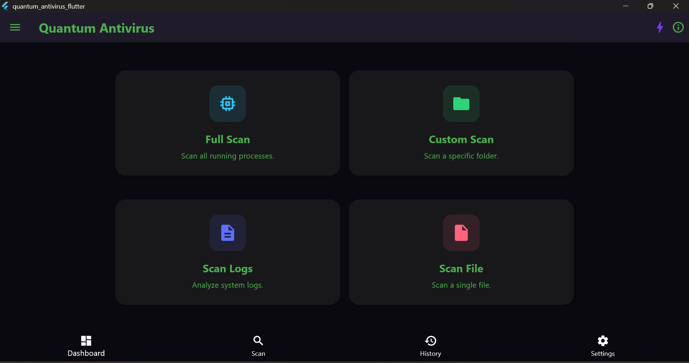
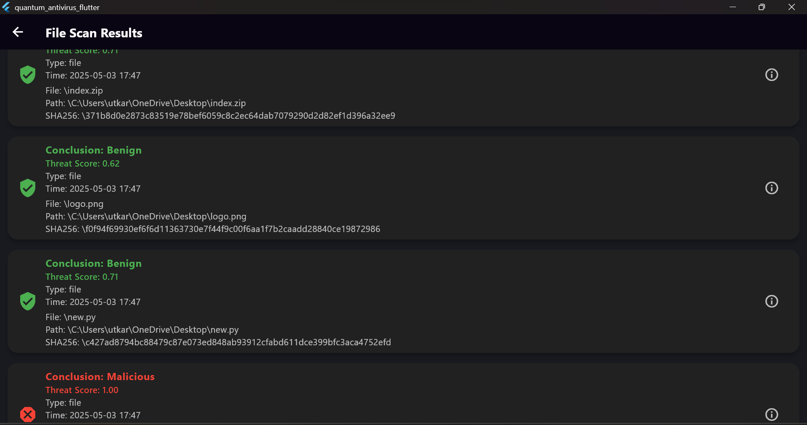

# 🚀 Quantum Antivirus

A modern, cross-platform antivirus solution powered by **Flutter** (frontend) and **Python FastAPI** (backend) with integrated **Machine Learning** for advanced threat detection.

---

## ✨ Overview
Quantum Antivirus is a next-generation antivirus application designed to provide robust, real-time protection against malware and cyber threats. It features both **static (hash-based) scanning** for known threats and **dynamic (ML-based) scanning** for zero-day malware by detecting suspicious patterns. Leveraging the power of machine learning, it delivers fast, accurate, and intelligent scanning for files, processes, and system logs—all wrapped in a beautiful, responsive UI.

---

## 🛠️ Tech Stack

- **Frontend:** Flutter (Dart)
  - Responsive, cross-platform UI (Windows, Web, Mac, Linux, Android, iOS)
  - Modern design with smooth animations
- **Backend:** Python FastAPI
  - High-performance REST API
  - Handles scan requests and ML inference
- **Machine Learning:**
  - Scikit-learn, XGBoost models (joblib/pkl)
  - Real-time malware detection
- **Other:**
  - Shared Preferences for local storage
  - File Picker for flexible scanning

---

## 🌟 Features

- **Static & Dynamic Scanning:**
  - **Hash-based scanning** for instant detection of known threats
  - **ML-powered dynamic scanning** for zero-day malware by analyzing suspicious patterns
- **Quantum Mode:** Advanced ML-powered scanning for files, processes, and logs
- **Real-Time Protection:** Fast, accurate threat detection
- **Beautiful UI:** Clean, modern, and accessible interface
- **Cross-Platform:** Works on desktop and web
- **Scan History:** View past scans and results
- **Custom Scans:** Scan specific files, folders, or system logs
- **About & Settings:** Device info and app details

---

## 🚦 Quick Start

### 1. Clone the Repository
```sh
git clone https://github.com/utcrxsh/quantum_antivirus.git
cd quantum_antivirus
```

### 2. Backend Setup (Python FastAPI)
```sh
cd python_backend
pip install -r requirements.txt
uvicorn main:app --reload
```

### 3. Frontend Setup (Flutter)
```sh
cd flutter_app
flutter pub get
flutter run -d windows
```

---

## 📸 Screenshots

<p align="center">
  
</p>

---
<p align="center">
  
</p>
 
---

## 💡 Why Quantum Antivirus?
- **Cutting-Edge ML:** Uses real machine learning models for malware detection
- **Static & Dynamic:** Combines hash-based and ML-based scanning for comprehensive protection
- **Full-Stack:** Demonstrates expertise in both Flutter and Python ecosystems
- **Production-Ready:** Clean architecture, modular code, and scalable design
- **Recruiter Appeal:** Showcases modern UI/UX, cross-platform skills, and backend ML integration

---

## 🤝 Contributing
Pull requests are welcome! For major changes, please open an issue first to discuss what you would like to change.

---

## 📄 License
[MIT](LICENSE)

---

<p align="center">
  <b>Quantum Antivirus &mdash; Secure. Smart. Stunning.</b>
</p>

## Project Structure

```
/quantum_antivirus_project/
├── flutter_app/
│   ├── lib/
│   ├── assets/
│   └── pubspec.yaml
├── python_backend/
│   ├── model/
│   │   └── malware_detector.pkl
│   ├── scanner.py
│   ├── runner.py
│   ├── requirements.txt
│   └── utils.py
├── integration/
│   └── glue_code.py
└── README.md
```

## Setup

### Python Backend
1. Navigate to `python_backend/`.
2. Create a virtual environment and activate it:
   ```bash
   python -m venv venv
   source venv/bin/activate  # On Windows: venv\Scripts\activate
   ```
3. Install dependencies:
   ```bash
   pip install -r requirements.txt
   ```
4. Place your trained model as `model/malware_detector.pkl`.

### Flutter Frontend
1. Navigate to `flutter_app/`.
2. Install dependencies:
   ```bash
   flutter pub get
   ```
3. Run the app:
   ```bash
   flutter run -d windows
   ```

## Usage
- The Flutter app communicates with the Python backend using `Process.run()`.
- Use the UI to trigger scans (processes, files, logs).
- Results are displayed in the app.


