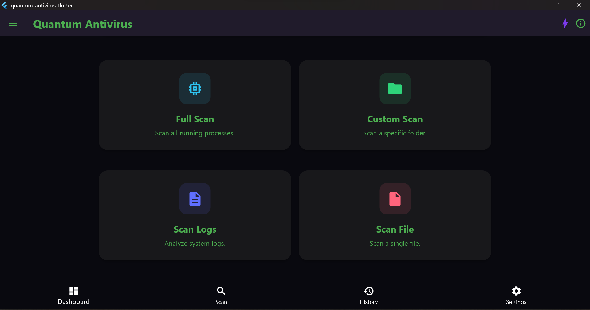
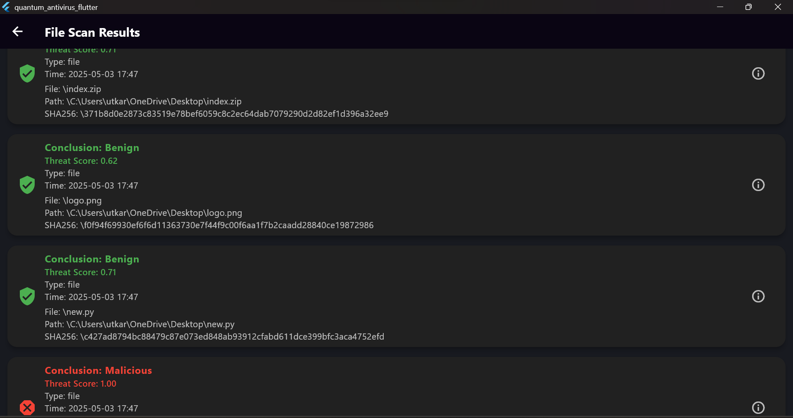

#  Quantum Antivirus

A modern, cross-platform antivirus solution powered by **Flutter** (frontend) and **Python FastAPI** (backend) with integrated **Machine Learning** for advanced threat detection.

---

## ✨ Overview
Quantum Antivirus is a next-generation antivirus application designed to provide robust, real-time protection against malware and cyber threats. It features both **static (hash-based) scanning** for known threats and **dynamic (ML-based) scanning** for zero-day malware by detecting suspicious patterns. Leveraging the power of machine learning, it delivers fast, accurate, and intelligent scanning for files, processes, and system logs—all wrapped in a beautiful, responsive UI.

---

## 🛠️ Tech Stack

- **Frontend:** Flutter (Dart)
  - Responsive, cross-platform UI (Windows, Web, Mac, Linux, Android, iOS)
  - Modern design with smooth animations
- **Backend:** Python FastAPI
  - High-performance REST API
  - Handles scan requests and ML inference
- **Machine Learning:**
  - Scikit-learn, XGBoost models (joblib/pkl)
  - Real-time malware detection
- **Other:**
  - Shared Preferences for local storage
  - File Picker for flexible scanning

---

## 🌟 Features

- **Static & Dynamic Scanning:**
  - **Hash-based scanning** for instant detection of known threats
  - **ML-powered dynamic scanning** for zero-day malware by analyzing suspicious patterns
- **Quantum Mode:** Advanced ML-powered scanning for files, processes, and logs
- **Real-Time Protection:** Fast, accurate threat detection
- **Beautiful UI:** Clean, modern, and accessible interface
- **Cross-Platform:** Works on desktop and web
- **Scan History:** View past scans and results
- **Custom Scans:** Scan specific files, folders, or system logs
- **About & Settings:** Device info and app details

---


---

## 📸 Screenshots

<p align="center">
  
</p>

---
<p align="center">
  
</p>
 
---

<p align="center">
  <b>Quantum Antivirus &mdash; Secure. Smart. Stunning.</b>
</p>


## Setup

### 1. Clone the Repository
```sh
git clone https://github.com/utcrxsh/quantum_antivirus.git
cd quantum_antivirus
```

### 2. Backend Setup (Python FastAPI)
```sh
cd python_backend
pip install -r requirements.txt
uvicorn main:app --reload
```

### 3. Frontend Setup (Flutter)
```sh
cd flutter_app
flutter pub get
flutter run -d windows
```


